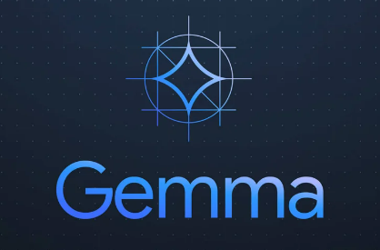
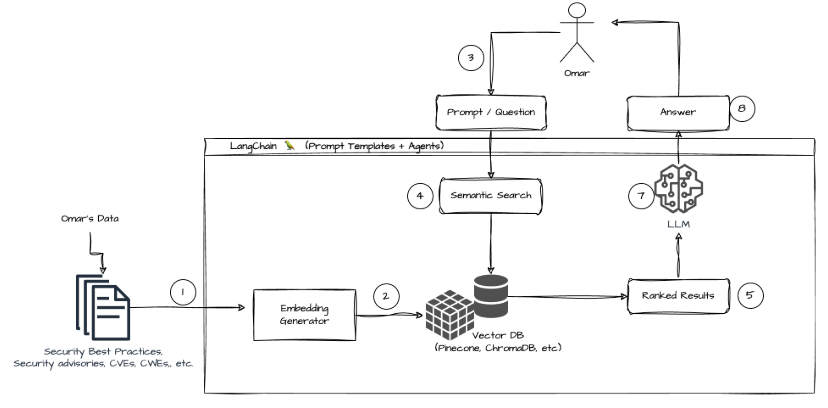
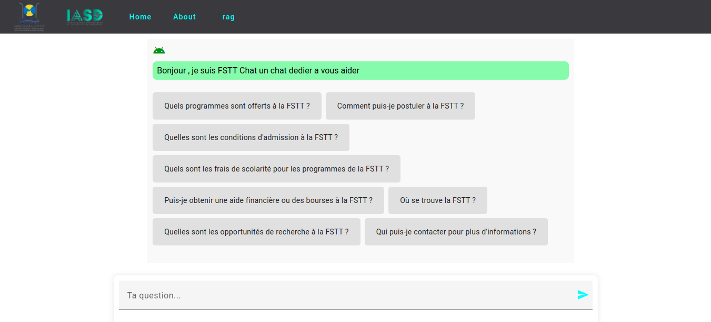
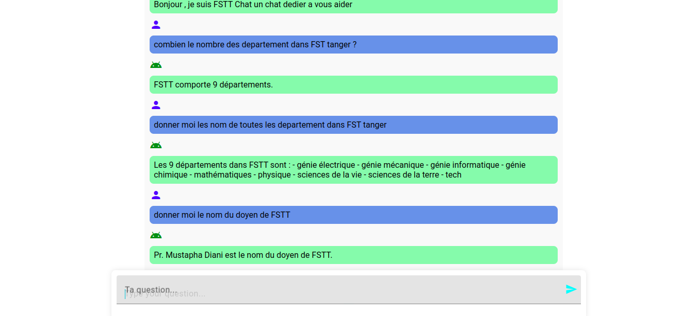

# Fine-Turn and RAG French FSTT chatbot

This repository contains a chatbot application (for french language) designed to assist students and visitors of the Faculty of Sciences and Techniques in Tanger (FSTT) website. The chatbot utilizes natural language processing (NLP) to understand user queries and provide relevant information about the university's programs, courses, and other academic-related topics.

The ChatBot is implemented with two approach: 
- Retrival-Augmented Generation (RAG).
- Fine-Tuning.

This README provides instructions on how to set up and run the Chroma Vector database using Docker, how to Create *RAG* System for **Gemma 2b LLM**, how to *Fine-Turn* Gemma 2b LLM and how to run the chatbot interface.



## 𝐊𝐞𝐲 𝐅𝐞𝐚𝐭𝐮𝐫𝐞𝐬 :

- 🔹 **Model Flexibility**: Users can effortlessly switch between RAG and fine-tuned models, tailoring the chatbot's capabilities to their specific needs.

- 🔹 **Blazing Fast Performance**: Built with Angular, our front-end guarantees a responsive and seamless user experience.

- 🔹 **Scalable Architecture**: Our application is containerized using Docker, ensuring it can scale and adapt to various environments effortlessly.

- 🔹 **Advanced Back-End**: Utilizing Flask, ChromaDB, and a fine-tuned version of the gemma 2b-it model, our back-end is robust and efficient.



## Prerequisites :

- **Docker** and **Python** must be installed on your system.
- Ensure you have internet access for downloading the necessary Docker image and model.

## Repository Structure

```
|FSTT_chatbot/
|
├── ChatBot-FSTT-Front-End/
|      # This folder contains the Front-End App of the Chatbot.
├── Data/
│   ├── scraping data/   # contains the code source of scraping the data 
│   └── fstt-articles.csv
│   └── fstt-clubs-info.csv
│   └── fstt-departements-info.csv
│   └── fstt-formation-initial.csv
│   └── general_info.csv
│   └── save_to_chroma.ipynb   # save the data into the vector database (ChromaDB)
├── Fine-tuning/
│   ├── Fine-tuning the model and save the Adaptor on Hugging Face.ipynb
|         # the source code of Fine-tuning the model and save the Adaptor on Hugging Face.
├── RAG_Gemma/
│   ├── RAG Gemma.ipynb   # contains the code source of the RAG System for Gemma-2b-it LLM
├── api/
│   ├── api.py   # Flask API App for generating answers fron RAG and Fine-turned LLM.
│   └── RAG.py   # the RAG System for Gemma-2b-it LLM
├── README.md
├── docker-compose.yml   # A Docker Compose file to set up and manage multi-container Docker applications.
└── requirements.txt   # Lists the Python dependencies needed to run the project.
```

## Running the Project :

### Install the Project :

   ```sh
   git clone https://github.com/drisskhattabi6/FSTT_chatbot.git
   cd FSTT_chatbot
   ```

### Set up the requisites :

- install the requirements python libraries :

  ```sh
  pip install -r requirements.txt
  ```

- run cmd (need good Internet):
  
  ```sh
   docker compose up
   ```

### Create Chroma Vector Database :

To save data to the Chroma Vector database, use the provided Jupyter Notebook.

1. Open the Jupyter Notebook located at `Data/save_to_chroma.ipynb`.

2. Follow the instructions within the notebook to save your data to the Chroma Vector database.

### run the chatbot interface :
- click `Ctrl+C` then restart the app :
  
 ```sh
   docker compose up
   ```
- Go to this URL : 

```sh
   http://localhost:4200/
   ```





## 📊 𝐓𝐞𝐜𝐡 𝐒𝐭𝐚𝐜𝐤 𝐎𝐯𝐞𝐫𝐯𝐢𝐞𝐰 :
- Front-End: Angular
- Back-End: Flask, ChromaDB
- Language Models: gemma 2b-it, Huggingface

---

## More Informations :

- the fine-turned LLM : https://huggingface.co/aymanboufarhi/gemma2B-chat-bot-fstt
- there is two option (fine-turn and RAG) in Chatbot App, so if you want to use the fine-turned llm, the app will download the llm from previous link, but if you want to use RAG, the app will download the gemma-2b-it llm. (so there is two separeted LLM)
- you must have a good laptop to run the two LLMs in the same time.
- you will need a good Internet to download the requirements files.

---

## Contributors

- **[Khattabi Idriss](https://github.com/drisskhattabi6)**
- **[Chihab Eddine Liefrid](https://github.com/novoSoftEng)**
- **[Boufarhi Ayman](https://github.com/aymanboufarhi)**

---

**Abdelmalek Essaadi University** - Faculty of Sciences and Techniques Tangier
   - Department : Computer Engineering
   - Master : AI & DS
   - Module : Natural Language Processing
   - Framed by : Pr. Lotfi ELAACHAK

---

Feel free to explore the project and customize it according to your requirements. If you encounter any issues or have any questions, don't hesitate to reach out!
